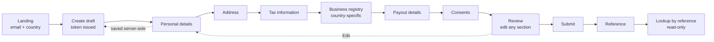

# Onboarding service

Self-service onboarding for solo entrepreneurs (sole traders) in **Germany, Poland and the
Netherlands**. An applicant enters an email address and a country, completes a multi-step
form, can leave and resume it, and submits it to receive an application reference.

It is one Spring Boot application: a REST API, a vanilla-JavaScript frontend served from the
same jar, and PostgreSQL. There are no accounts and no login — that is a constraint of the
assignment, not an omission.

**What it does**

- Start an application from an email address and a country
- Complete six form steps, ordered, with the next step gated on the previous one
- Save and resume a draft (same browser — see [Limitations](#15-assumptions-and-intentional-limitations))
- Field-level validation errors, server-authoritative, rendered beside the field that caused them
- Review every section, correct any of them, then submit
- Receive an unguessable application reference
- Retrieve a submitted application read-only by that reference

**Country handling.** Each country's form is declared in YAML (`src/main/resources/flows/`)
and enforced by named Java validator beans. The three countries differ in field *rules*
(postcode formats), in *which fields exist* (Handelsregister vs CEIDG vs KvK) and in consent
wording. There is no `if (country == DE)` branch in the Java or the JavaScript.

**Stack.** Java 21 · Spring Boot 3.5.16 · Gradle (wrapper included) · PostgreSQL 16 ·
Flyway · vanilla ES-module JavaScript. No frontend build step, no npm, no framework.

**Scope.** This is a deliberately small MVP built to a ~5-hour timebox. Read
[ASSUMPTIONS.md](ASSUMPTIONS.md) for the reasoning behind each decision and
[Bugs.md](Bugs.md) for known defects — including several found while writing this README and
left open on purpose rather than quietly patched.

---

## Contents

[Quick start](#2-quick-start) ·
[Running locally](#3-running-locally) ·
[Tests](#4-running-the-tests) ·
[Demo walkthrough](#5-demo-walkthrough) ·
[User flow](#6-user-flow) ·
[Architecture](#7-architecture) ·
[Data model](#8-data-model-and-lifecycle) ·
[REST API](#9-rest-api) ·
[Country-specific flow](#10-country-specific-flow) ·
[Validation](#11-validation-and-error-handling) ·
[Security and privacy](#12-security-and-privacy-considerations) ·
[Testing strategy](#13-testing-strategy) ·
[Engineering decisions](#14-engineering-decisions-and-trade-offs) ·
[Limitations](#15-assumptions-and-intentional-limitations) ·
[Evolution path](#16-evolution-path) ·
[Troubleshooting](#troubleshooting)

---

## 2. Quick start

### Recommended — everything in Docker

```bash
docker compose up --build
```

Then open **<http://localhost:8080/>**.

- **Prerequisites:** Docker with Compose v2. Nothing else — the JDK and Gradle run inside the
  build image.
- **Ports:** `8080` (application), `5432` (PostgreSQL, published to the host).
- **Ready when:** `curl -sf http://localhost:8080/api/flows` returns HTTP 200. Compose waits
  for PostgreSQL's healthcheck before starting the app, so the app container's first log line
  about Tomcat is also a reliable signal. First run takes a few minutes because the image
  builds the jar; subsequent runs take seconds.
- **First-run database:** the `postgres` container creates the `onboarding` database, and
  Flyway applies `V1__init.sql` at application startup. No manual step.
- **Environment variables:** none required. Compose sets the datasource variables for you.
- **Stop:** `Ctrl-C`, then `docker compose down`.

> There is no Spring Boot Actuator dependency, so **there is no `/actuator/health`**. Use
> `GET /api/flows` as the readiness check.

> The Compose `app` service does not set `SPRING_PROFILES_ACTIVE`, so `GET /api/dev/outbox`
> returns **404** in this stack. If you want to see resume links, use the local-development
> path below. Tracked as B7 in [Bugs.md](Bugs.md).

### Local development — Postgres in Docker, app on your machine

```bash
docker compose up -d postgres
SPRING_PROFILES_ACTIVE=dev ./gradlew bootRun
```

Then open **<http://localhost:8080/>**.

- **Prerequisites:** Docker (for PostgreSQL only) and a **JDK 21**. Gradle comes from the
  wrapper; do not install it.
- `SPRING_PROFILES_ACTIVE=dev` is optional and only enables `GET /api/dev/outbox`, which
  exposes the resume links the service records but never sends.
- **Stop:** `Ctrl-C`, then `docker compose stop postgres`.

There is **no Maven wrapper** in this repository. Every command uses `./gradlew`.

---

## 3. Running locally

From a fresh clone, macOS or Linux:

```bash
# 1. Enter the repository
git clone <repository-url> && cd zalando-onboarding-service

# 2. Check prerequisites
java -version        # must report 21 (only needed for the local-development path)
docker --version
docker compose version

# 3. Start PostgreSQL
docker compose up -d postgres

# 4. Start the application
SPRING_PROFILES_ACTIVE=dev ./gradlew bootRun

# 5. Open it
open http://localhost:8080/          # Linux: xdg-open http://localhost:8080/

# 6. Stop the application
#    Ctrl-C in the terminal running bootRun, then:
docker compose stop postgres
```

**7. Reset local data (destructive).**

```bash
docker compose down -v
```

`-v` **deletes the `postgres-data` volume and every application in it** — all drafts,
submitted applications and outbox rows. Any resume token in a browser's `localStorage` then
points at a row that no longer exists. Omit `-v` to stop the containers and keep the data.

**Windows.** Not verified. The repository ships `gradlew.bat`, so the commands should
translate directly, with `set SPRING_PROFILES_ACTIVE=dev` replacing the inline variable.

---

## 4. Running the tests

```bash
./gradlew test
```

**161 tests, 0 failures**, about 12 seconds from clean on a warm Gradle daemon.

Add `clean` (`./gradlew clean test`) to force a full re-run — Gradle reports `UP-TO-DATE` and
skips the suite when nothing has changed.

**Docker is required.** 35 of the 161 tests boot a Spring context against a real PostgreSQL 16
container via Testcontainers (`TestcontainersConfiguration`). The other 126 are plain JUnit
with no Docker, no Spring and no database.

| Category | Tests | Needs Docker | Covers |
|---|---:|---|---|
| Validators and flow config | 126 | no | checksum algorithms, per-country patterns, YAML loading, resume derivation, both validation layers |
| API and persistence | 35 | yes | HTTP behaviour end to end, gating, submission, timestamps, token entropy, the dev outbox |

There is **no H2 and no in-memory database**. The integration tests run against the same
PostgreSQL major version as production, so `ddl-auto: validate` and the JSONB mapping are
genuinely exercised.

Run a single class:

```bash
./gradlew test --tests 'com.zalando.onboarding.api.OnboardingApiTest'
```

**Why tests fail locally, in order of likelihood:** the Docker daemon is not running
(Testcontainers cannot start a container); the JDK is not 21; or a corporate proxy blocks
pulling `postgres:16-alpine` on the first run. See [Troubleshooting](#troubleshooting).

---

## 5. Demo walkthrough

All values below are fabricated or published test vectors. The identifiers carry real
checksums, so they must be exact — invented numbers will be rejected, which is the point.

**1. Start an application.** Open <http://localhost:8080/>. Enter any email
(`demo.user@example.com`) and pick **Germany**. Entering an email always starts a *new*
application; nothing is ever looked up by email.

**2. Trigger a validation error.** On *Personal details*, leave *First name* blank and set a
date of birth less than 18 years ago. Save. Two errors appear beside their own fields:
`REQUIRED` and `NOT_ADULT`. Nothing was persisted.

**3. Complete the steps.** Valid values per country:

| Step | Germany | Poland | Netherlands |
|---|---|---|---|
| Personal details | any name, DOB ≥ 18 years ago, nationality from the list | same | same |
| Postal code | `10115` | `00-950` | `1012 AB` |
| Tax | Tax number `12345678901`, VAT **No** | NIP `856-734-62-15` | VAT **No** |
| VAT id (only if VAT = **Yes**) | `DE136695976` | any text | any text |
| Business registry | Handelsregister **No** | REGON `192598184`, PKD `62.01.Z`, any date | KvK `12345678`, trade name, SBI `6201` |
| Payout | any holder name, IBAN `DE68 2105 0170 0012 3456 78` | same | same |
| Consents | tick **all five** | same | same |

**4. See country-specific fields.** Start three applications, one per country, and compare
step 4. Germany asks *Entered in the Handelsregister?* and reveals register type, number and
court only if you answer Yes. Poland asks unconditionally for REGON, CEIDG registration date
and PKD code. The Netherlands asks for KvK number, trade name and SBI code. Step 2 rejects
`00-950` as a German postcode and accepts it as a Polish one.

**5. See a per-country rule bite.** Enter the Polish NIP with separators (`856-734-62-15`).
It is accepted, and Review shows `8567346215` — the normalised form that was actually stored.

**6. Save and resume a draft.** Progress is stored server-side each time you press *Save and
continue*. Reload the page mid-form, or close the tab and return to <http://localhost:8080/>:
the landing page shows **Continue on this device** with your email, country and next step.

With the `dev` profile you can also use the resume link the service recorded but never sent:

```bash
curl -s localhost:8080/api/dev/outbox | python3 -m json.tool | grep resumeUrl
```

Open that URL in a private window — it drops the token into that browser and removes it from
the address bar.

> **Draft recovery is same-browser only.** The resume credential lives in `localStorage`.
> Clearing site data, switching browsers or moving to another device loses access
> permanently, because no email is ever sent. This is the documented MVP boundary, and the
> silent-failure case is recorded as B3 in [Bugs.md](Bugs.md).

**7. Review, correct, submit.** Review lists every section with an *Edit* link; the IBAN is
masked to its last four characters. Editing a section returns you to Review. Press **Submit
application**.

**8. Copy the reference** (e.g. `ONB-SMH2MWBAJYKDCBZ8`) from the confirmation screen.

**9. Look it up.** *Find a submitted application* in the header, paste the reference. The
application renders read-only: no Edit links, and the status reads `SUBMITTED`.

**10. Confirm immutability.** Any write against a submitted application is refused:

```bash
curl -i -X PUT localhost:8080/api/applications/$TOKEN/sections/address \
  -H 'Content-Type: application/json' -d '{"street":"x"}'
# HTTP/1.1 409  ... "code": "APPLICATION_ALREADY_SUBMITTED"
```

**11. Confirm submission is idempotent.** POST the submit endpoint twice; both calls return
the same reference.

---

## 6. User flow



Each step is persisted on *Save and continue*; nothing is autosaved while typing. A step
cannot be opened until the previous one is complete, but any completed step stays editable
while the application is a draft. Where to resume is derived from the last completed step on
every response and is never stored.

---

## 7. Architecture

One deployable Spring Boot application containing the API, the static frontend and the
migrations. The browser loads `index.html` from the same origin that serves `/api/**`, so
there is no separate frontend deployment, no CORS configuration and no second pipeline. For a
form this size that is the whole benefit — nothing here argues that splitting it would be
worse at a different scale.

```
Browser  ──fetch──▶  Spring MVC controllers  ──▶  ApplicationService  ──▶  PostgreSQL
   ▲                        │                          │
   └── static/*.js          │                          ├── flow definitions (YAML, startup)
       from the jar         └── @RestControllerAdvice   └── validator beans (layer 1 + 2)
                                RFC 7807 problem+json
```

| Package | Responsibility |
|---|---|
| `api` | Controllers, request/response records, the request-id servlet filter. Transport only |
| `api.error` | `@RestControllerAdvice` producing `application/problem+json` for every error |
| `domain` | `Application` entity, repository, and `ApplicationService` — all state rules |
| `flow` | Flow definitions loaded from YAML at startup; resume derivation |
| `validation` | Layer 1 (field) and layer 2 (submission) validators, resolved by name |
| `notification` | `NotificationPort` and an outbox adapter that records resume links |
| `support` | Clock, token generation, configuration properties |
| `decision` | **Empty.** Mocked decisioning is described in ASSUMPTIONS A1 and is *not implemented* |

**Frontend** (`src/main/resources/static/`) is three files — `index.html`, `app.js`,
`styles.css` — totalling about 1,100 lines. `app.js` is a single ES module with hash-based
routing and `fetch`; it renders every form control from the flow definition the API returns.
Packaged into the jar by Gradle's normal resource handling and served by Spring's static
resource handler with `Cache-Control: no-cache`, so an unversioned `app.js` revalidates on
every load instead of going stale after a deploy.

**Persistence** is a single `applications` table plus a `notification_outbox` table, created
by Flyway (`V1__init.sql`). Hibernate runs with `ddl-auto: validate` — Flyway owns the schema
and Hibernate only checks the mapping still matches it.

---

## 8. Data model and lifecycle

One table, `applications`. Lifecycle fields are relational columns; the partially completed,
country-dependent form content lives in one JSONB column.

| Column | Type | Notes |
|---|---|---|
| `id` | `UUID` PK | Internal identifier. Never appears in a URL |
| `draft_token_hash` | `TEXT` unique | **SHA-256 of the resume token.** The plaintext is returned once at creation and never stored |
| `reference` | `VARCHAR(24)` unique | Public reference, set only at submission |
| `applicant_email` | `VARCHAR(320)` | Trimmed and lower-cased before storage |
| `country` | `CHAR(2)` | `DE`/`PL`/`NL`, `CHECK`-constrained. Mapped non-updatable |
| `status` | `VARCHAR(20)` | `DRAFT` or `SUBMITTED`, `CHECK`-constrained. No other value exists |
| `last_completed_step` | `VARCHAR(30)` | The furthest section actually completed; `NULL` on a fresh draft. Deliberately excludes `REVIEW` |
| `schema_version` | `SMALLINT` | How to read `form_data` after its shape changes. Not flow versioning |
| `form_data` | `JSONB` | One key per completed section, each carrying its own `completedAt` |
| `decision` | `JSONB` | Column exists; **nothing writes it** |
| `row_version` | `BIGINT` | JPA `@Version` — optimistic locking, since two tabs write the same row |
| `submitted_at` | `TIMESTAMPTZ` | Set with the reference, in the same statement |
| `created_at` / `updated_at` | `TIMESTAMPTZ` | `updated_at` owned solely by Hibernate `@UpdateTimestamp` |

**Three identifiers, three jobs — do not conflate them:**

| | Visible to | Purpose |
|---|---|---|
| **`id` (UUID)** | nobody outside the service | internal key, logging, foreign keys |
| **Draft token** | the applicant only | the resume *credential*. 256 random bits, URL-safe; only its hash is stored |
| **Reference** (`ONB-…`) | the applicant and support | the public *name* of a submitted application. 80 bits over a Crockford base32 alphabet with I, L, O and U removed, so it survives being read down a phone |

**Email uniqueness is enforced only across submitted applications:**

```sql
CREATE UNIQUE INDEX ux_applications_email_submitted
  ON applications (applicant_email) WHERE status = 'SUBMITTED';
```

Duplicate **drafts** with the same email are permitted. The filter is load-bearing, not
stylistic: an unfiltered unique constraint would let anyone lock a person out of onboarding
just by starting a draft with their address. The rule therefore reads *one submitted
application per email*, checked at submit. There is **no** "one active draft per email and
country" rule — that would be a possible future policy, not current behaviour.

**Lifecycle.**

```text
DRAFT ──submit──▶ SUBMITTED
```

Two states, one transition, no way back. Immutability after submission is enforced in three
independent places: the service refuses writes to a non-draft (409), the entity throws if
asked to mutate, and a `CHECK` constraint makes a half-submitted row unrepresentable (a draft
has neither reference nor `submitted_at`; a submitted application has both).

The transition itself is a single conditional statement, so two simultaneous submits cannot
both win:

```sql
UPDATE applications SET status = 'SUBMITTED', reference = ?, submitted_at = ?
 WHERE id = ? AND status = 'DRAFT'
```

One row updated means this caller performed the submission; zero rows means somebody else did,
and the caller re-reads and returns the existing reference. The reference is generated *inside*
the transition, never before it, so a losing caller never mints one.

---

## 9. REST API

No authentication headers. **The draft token is a path segment because it *is* the
credential** — holding it is what authorises the call. Content type is `application/json`;
every error is `application/problem+json`.

| Method | Path | Purpose | Success | Failures |
|---|---|---|---|---|
| `POST` | `/api/applications` | Start a draft from `{email, country}` | `201` `{applicationId, draftToken, resumeUrl, flow}` | `400` malformed email or unknown country |
| `GET` | `/api/applications/{draftToken}` | Load a draft | `200` `{status, country, email, lastCompletedStep, resumeStep, formData, flow}` | `404` unknown token |
| `PUT` | `/api/applications/{draftToken}/sections/{sectionId}` | Save one completed section | `200` `{lastCompletedStep, resumeStep, savedSection}` | `400` field violations or `SECTION_UNKNOWN`; `409` `SECTION_NOT_REACHABLE`, `APPLICATION_ALREADY_SUBMITTED`, `CONCURRENT_MODIFICATION`; `404` unknown token |
| `POST` | `/api/applications/{draftToken}/submit` | Submit; idempotent | `200` `{reference, status, submittedAt}` | `400` `SECTION_MISSING` per incomplete section; `409` `EMAIL_ALREADY_SUBMITTED`; `404` unknown token |
| `GET` | `/api/applications/reference/{reference}` | Read a submitted application | `200` `{reference, status, submittedAt, country, email, formData, flow}` | `404` unknown reference |
| `GET` | `/api/flows` | Every supported country's flow definition | `200` array | — |
| `GET` | `/api/flows/{country}` | One country's flow definition (case-insensitive) | `200` | `400` `COUNTRY_UNKNOWN` |
| `GET` | `/api/dev/outbox` | Recorded resume links. **`dev` profile only** | `200` array | `404` when the profile is inactive |

Every response — success or failure — carries an `X-Request-Id` header, echoing a valid
inbound one or generating a UUID.

A minimal end-to-end exchange:

```bash
TOKEN=$(curl -s -X POST localhost:8080/api/applications \
  -H 'Content-Type: application/json' \
  -d '{"email":"demo.user@example.com","country":"DE"}' | python3 -c 'import json,sys;print(json.load(sys.stdin)["draftToken"])')

curl -s -X PUT localhost:8080/api/applications/$TOKEN/sections/personalDetails \
  -H 'Content-Type: application/json' \
  -d '{"firstName":"Demo","lastName":"Muster","dateOfBirth":"1990-05-17","nationality":"DE"}'

curl -s -X POST localhost:8080/api/applications/$TOKEN/submit
```

---

## 10. Country-specific flow

Country is chosen at creation and selects the flow definition. Three layers, with distinct
jobs:

**1. Flow definitions (YAML) — `src/main/resources/flows/{DE,PL,NL}.yml`.** Declare the
sections, their order, each field's type, label, options, length limit, pattern, conditional
visibility, and the names of the validators that apply. Unknown YAML keys are rejected at
startup, and every validator name is checked against the registry at startup, so a typo stops
the application rather than silently disabling a rule.

**2. Java validator beans — `validation/`.** Own correctness. Resolved by the name the YAML
references (`iban`, `nip`, `regon`, `kvk`, `vatIdDe`, `adult`); two beans claiming one name is
a startup failure.

**3. Database constraints.** Protect lifecycle invariants only — status values, the
draft/submitted shape, email uniqueness among submitted rows. They deliberately encode **no**
country business rules, so adding a country needs no migration.

**The frontend renders from the flow definition it is given.** `app.js` contains no country
codes, no country names and no field names beyond the `iban` *validator* name used to decide
masking. Labels, dropdown options and conditional visibility all arrive from the API. Adding a
fourth market is a YAML file plus an enum value plus the `CHECK` constraint — no JavaScript
change.

**Frontend validation is convenience; the backend is authority.** The client hides a field
whose condition is not met and shows errors beside the right input, but every rule is
re-applied server-side. With no authentication, a client can `POST` any endpoint in any order,
so anything the browser enforces is not enforced at all.

What actually differs between the three (from the YAML, illustrative and **not legal
compliance advice**):

| | Germany | Poland | Netherlands |
|---|---|---|---|
| Postal code | `^\d{5}$` | `^\d{2}-\d{3}$` | `^\d{4} ?[A-Za-z]{2}$` |
| Tax section | Steuernummer + optional USt-IdNr. (checksum-validated) | NIP (checksum-validated) + optional VAT UE | VAT question + optional btw-id |
| Registry | Handelsregister, gated on a yes/no — a Kleingewerbe has no entry | CEIDG: REGON (checksum), registration date, PKD — unconditional | KvK number (checksum), trade name, SBI |
| Credit-check consent | SCHUFA | BIK | BKR |

The consent *item set* is the same five in all three markets; only the credit-bureau wording
and version differ. The engine supports genuinely different item sets — `FlowVariationCapabilityTest`
proves it — but inventing a difference to demonstrate the capability would put fiction into
shipped configuration.

**Country is immutable after creation.** It selects the flow, so changing it would strand
already-completed country-specific sections — a Polish REGON sitting in an application that is
now German. Cascade-invalidation is not worth its cost at this size; the honest V1 answer is
to start a new application. The column is mapped non-updatable and the entity exposes no
setter.

---

## 11. Validation and error handling

Two layers, one response contract.

**Layer 1 — saving a section.** Field-level: required, conditional requirement, length,
pattern, then the named validators (IBAN mod-97, NIP/REGON/KvK/USt-IdNr. checksums, adult age).
Checks stop at the first failure *per field*, so one mistake yields one message rather than a
cascade. If anything fails, **nothing is persisted**. Unknown fields are rejected rather than
dropped.

**Layer 2 — submitting.** Completeness against this country's flow, plus cross-section rules
(the credit-check consent must be accepted). This is **not** redundant: with no
authentication, a client can `POST /submit` against a half-filled application without ever
having walked the form.

Both layers return **RFC 7807 `application/problem+json`**, so the client has one rendering
path. A real response from a running instance:

```json
{
  "type": "https://onboarding.zalando.com/problems/validation-error",
  "title": "Validation failed",
  "status": 400,
  "instance": "/api/applications/{draftToken}/sections/personalDetails",
  "requestId": "91125645-8bea-4d82-8d16-ca373e04ebf8",
  "violations": [
    { "field": "firstName",   "section": "personalDetails", "code": "REQUIRED",  "message": "This field is required" },
    { "field": "dateOfBirth", "section": "personalDetails", "code": "NOT_ADULT", "message": "You must be at least 18 years old" }
  ]
}
```

A violation names a `field`, or a `section` when it is section-level (`SECTION_MISSING`), or
neither when it concerns the application as a whole. Clients branch on `code`, never on
`message`.

**The frontend** places each violation beside the input it names. A violation naming a field
that is not on screen — a section-level code, or a field this flow hides — goes to a summary
at the top of the form, so nothing is silently swallowed.

**Status codes.** `400` means the payload is wrong. `409` means the application's state does
not permit the call — forward gating, writing after submission, an email another submitted
application holds, or an optimistic-lock conflict. `404` means an unknown draft token or
reference. Every problem body carries `requestId`, matching the `X-Request-Id` response header
and the MDC value on every log line for that request.

**Optimistic locking.** Two tabs saving different sections write the same row. The loser gets
`409 CONCURRENT_MODIFICATION` and can safely retry, because nothing was written.

**Idempotent submission.** Submitting twice returns the same reference and the same
`submittedAt`. A double-click is not an error and must not mint a second reference.

---

## 12. Security and privacy considerations

Only what is actually implemented.

- **No accounts, sessions or login**, as the assignment requires.
- **Bearer credentials with real entropy.** Draft tokens are 256 random bits from
  `SecureRandom`, URL-safe base64. References are 80 bits over a Crockford base32 alphabet.
  Neither derives from a sequence, a timestamp or anything enumerable.
- **Only the hash of the draft token is stored** (SHA-256). The plaintext is returned once, at
  creation. A database dump yields no working resume links. The hash is unsalted deliberately:
  the token must be findable by hash, and the input is 256 random bits, so there is no
  dictionary to slow an attacker against.
- **No enumeration oracle at the entry point.** An email is never looked up. Entering one
  always creates a new draft, so the response is identical whether or not that person already
  has an application.
- **Tokens are never logged.** Log lines carry `applicationId`, `reference` and `requestId`
  only. Resume links go to the outbox table rather than a log line for exactly this reason.
- **Request IDs** in the MDC and on every response, so support can trace a call without any
  personal data being logged. An inbound `X-Request-Id` is honoured only if it matches a
  conservative charset — an unfiltered header reaches log lines and a response header, which
  is a log-forging and header-splitting hole.
- **No PII in `toString()`** on the entity, and none in error messages.
- **Nothing but the token is kept client-side.** No application data is written to
  `localStorage`.
- **Submitted applications cannot be modified**, enforced in the service, the entity and the
  schema.
- **The frontend never uses `innerHTML`**; all text goes through `textContent`.

**Known limitations — stated plainly.**

- **Draft tokens appear in URLs.** The token is a path segment, and the resume link puts it in
  a URL fragment. That is inherent to a bearer-credential design with no login, and it means
  tokens can reach browser history and any intermediary that logs paths. It also means
  **error bodies echo the token** in the RFC 7807 `instance` field, which Spring fills from the
  request URI (recorded as B8 in [Bugs.md](Bugs.md)).
- **Anyone holding a reference can read the whole submitted application**, including name,
  date of birth, tax number and email. That follows directly from "no authentication".
- **IBAN masking is display-only.** The browser shows the last four characters; the API
  returns the full value to whoever holds the token or reference.
- **No email is ever sent.** A `NotificationPort` and an outbox adapter exist; there is no
  provider. Secure cross-device recovery would need an expiring emailed resume link plus proof
  of email ownership — both depend on notifications, which the assignment excludes.
- **No rate limiting, no CSRF tokens, no field-level encryption at rest.**
- **Consent validation has real holes** (B1 and B2 in [Bugs.md](Bugs.md)): a consent sent as
  `false` passes layer 1, and consent `version`/`acceptedAt` are unvalidated client input.

---

## 13. Testing strategy

161 tests. Each targets a specific way this system could be wrong, not a coverage number.

**Unit — validators and flow configuration (126 tests, no Docker).**

| Risk | Tests |
|---|---|
| A checksum rule that accepts wrong numbers | `NipValidatorTest`, `RegonValidatorTest`, `IbanValidatorTest`, `FormatValidatorsTest` — published test vectors, valid and invalid |
| An age boundary off by a day | `AdultValidatorTest` against a fixed `Clock` |
| A country's rule silently not applying | `SectionValidatorTest` — each country's postcode rejected by the other two; a validator name with no bean fails startup (`FlowValidatorReferenceCheckTest`, `ValidatorRegistryTest`) |
| Conditional fields misjudged | `RequiredWhenTest` — coercion, absence, and the opposite answer |
| Layer 2 letting an incomplete application through | `SubmissionValidatorTest` — one `SECTION_MISSING` per missing section, per country; credit-check consent enforced in all three markets |
| Resume derived wrongly | `ResumeDerivationTest` — every country, including "last section done ⇒ REVIEW" |
| Broken YAML reaching a running app | `YamlFlowDefinitionRepositoryTest` |
| Config that cannot express real variation | `FlowVariationCapabilityTest` |

**Integration — API and persistence (35 tests, Docker required).** `OnboardingApiTest` drives
everything over HTTP against real PostgreSQL, because the rules being asserted exist to survive
a client that ignores the intended order:

- forward gating blocks skipping a step, and nothing is written on the way past
- backward editing of a completed section is allowed
- `last_completed_step` never moves backward — asserted against the row, not the response
- a layer-1 failure persists nothing and leaves progress untouched
- submitting a half-filled draft returns one `SECTION_MISSING` per missing section, and the
  application stays `DRAFT`
- submitting twice returns exactly one reference — sequentially, **and** with two threads
  racing the conditional `UPDATE`, which is the only way to exercise the zero-rows branch
- writing to a submitted application is `409`
- an unknown token and an unknown reference are both `404`
- values are stored normalised, not as typed
- creating a draft writes a `RESUME_LINK` outbox row in the same transaction
  (`DevOutboxEndpointTest` then resumes through it)
- request IDs are echoed, and a log-forging header is replaced
- `ApplicationTimestampsTest` pins `updated_at` ownership; `SecureTokenGeneratorTest` pins
  token entropy and uniqueness

**Not covered.** No frontend automated tests — `app.js` was verified by walking a full German
application in a browser, which is honest but not repeatable in CI. No load or security
testing. No test asserts the consent holes in [Bugs.md](Bugs.md), because they are open.

---

## 14. Engineering decisions and trade-offs

### Smallest coherent architecture

*Problem:* deliver a working multi-step, multi-country onboarding flow in about five hours.
*Choice:* one Spring Boot application with internal package boundaries — API, domain, flow,
validation, notification — and one database.
*Why:* every boundary that would become a network hop here is a boundary I can move later for
free, and moving it now would cost deployment, tracing and failure handling that buy nothing at
this scale. Serving the frontend from the same jar removes CORS, a second pipeline and a whole
class of environment configuration.
*Trade-off:* the frontend cannot be deployed or scaled independently, and everything shares one
JVM's failure domain.
*Revisit when:* the frontend needs its own release cadence, or one part of the API develops
load characteristics the rest does not share.

### Vanilla JavaScript instead of a framework

*Problem:* render six ordered screens whose fields are not known at build time.
*Choice:* one ES module, `fetch`, hash routing, ~750 lines, no build step and no dependencies.
*Why:* the flow is linear and the shared client state is one token plus the server's own
`resumeStep`. A framework would add a build pipeline, a dependency surface to keep patched, and
a lockfile — for a page whose hardest problem is "render the field the API described".
Crucially, the fields come from configuration anyway, so a component library would mostly wrap
a `switch` on field type.
*Trade-off:* no component reuse across a wider product, manual DOM updates, and no
framework-provided testing tools.
*Revisit when:* the workflow becomes non-linear (branching, cross-step dependencies), a design
system needs sharing with other applications, or more than one or two people work on the
frontend at once.

### The backend is the source of truth

*Problem:* validation rules exist in two places — where the user types, and where data is
stored.
*Choice:* the client renders the rules the API declares and shows the errors the API returns;
Java owns correctness. The client sets no `required` or `pattern` attributes that would let the
browser refuse a submission the server never saw.
*Why:* there is no authentication, so any endpoint can be called in any order. Anything only the
browser enforces is not enforced. A single error contract also means one rendering path for both
validation layers.
*Trade-off:* every empty required field costs a round trip.
*Revisit when:* latency makes that round trip noticeable — at which point the client can
pre-check using the same declarations, without becoming the authority.

### Country variation as configuration, not code

*Problem:* three countries differ in field rules, in which fields exist, and in consent wording.
*Choice:* declare the flows in YAML; implement the rules as named Java validator beans; resolve
names at startup and fail loudly on a mismatch.
*Why:* it handles all three kinds of variation with one mechanism, and adding a fourth market is
a configuration change. A generic workflow or form-definition platform — versioned definitions,
a rules DSL, runtime editing — would be a product in itself, and three similar linear flows do
not justify one.
*Trade-off:* YAML is not type-checked by the compiler; the startup checks exist because of that.
*Revisit when:* non-engineers need to change flows at runtime, or country flows diverge enough
that ordering and branching become genuinely different.

### Hybrid persistence: relational lifecycle, JSONB content

*Problem:* the lifecycle is identical across countries; the form content is not, and is
partially filled for most of its life.
*Choice:* lifecycle fields as typed columns with constraints and indexes; all section data in
one `form_data` JSONB column, one key per completed section.
*Why:* the fields worth constraining, indexing and reasoning about are the same everywhere.
Modelling three countries' form fields relationally would mean either a sparse table or a
per-section table, and retrieval by reference becomes a single read this way.
*Trade-off:* the blob is not queryable with the schema's help and needs `schema_version` to stay
readable; two tabs saving different sections contend on one row, handled with optimistic
locking.
*Revisit when:* analytics need to query across applicants' field values, or sections need
independent concurrent writes.

### A draft credential and a public reference are different things

*Problem:* an applicant must return to an unfinished application before any public identifier
exists, and must quote something to support afterwards.
*Choice:* two separate values — a high-entropy draft token, stored only as a hash, issued at
creation; and a human-readable reference minted at submission.
*Why:* they have different lifetimes, different audiences and different disclosure risk. Reusing
one value for both would either hand out the resume credential to anyone quoting a reference, or
make the applicant read 43 base64 characters down a phone.
*Trade-off:* two identifiers to explain.
*Revisit when:* accounts exist — at which point the draft token disappears entirely.

### Scope discipline around email

*Problem:* email is collected at step 0, and the natural thing to do with it is send a resume
link. Notifications are explicitly out of scope.
*Choice:* build the port and a recording outbox adapter; write the link in the same transaction
as the draft; never send it. A dev-profile endpoint exposes it.
*Why:* the link has to go somewhere, and a port plus a recording adapter costs about half an
hour and turns a missing feature into a one-line adapter swap. Writing it to the outbox rather
than a log is deliberate: the link is a bearer credential.
*Trade-off:* recovery is same-browser only, and its failure mode is currently silent (B3).
*Revisit when:* a notification provider exists — at which point email verification becomes one
guard on section writes, not a new subsystem.

### Immutable country, immutable submission

*Problem:* what may change after a value is committed.
*Choice:* country is fixed at creation; submission is a one-way, idempotent transition.
*Why:* country selects the flow, so changing it strands completed country-specific sections.
Submission immutability is what makes a reference mean something. Both are enforced in the
service, the entity and the schema, so no single mistake can bypass them.
*Trade-off:* a wrong country means starting over, and there is no withdrawal.
*Revisit when:* the funnel data shows people picking the wrong country often enough to justify
cascade-invalidation.

### Operational and privacy thinking

Request IDs in the MDC and on every response; structured RFC 7807 errors with machine-readable
codes; identifiers rather than personal data in logs; token hashing; the outbox instead of a log
line for resume links; `no-cache` on unversioned static assets so a deploy cannot leave users on
a stale `app.js`; `ddl-auto: validate` so a mapping drift fails at startup rather than at
runtime.

---

## 15. Assumptions and intentional limitations

**Required by the assignment** — not attempted:

- No authentication, accounts or sessions
- No real eID, KYC, company registry, credit bureau or banking integrations
- No real compliance, tax or AML decisioning
- No email or SMS notifications
- No review, approval or rejection workflow
- No editing or withdrawing an application after submission
- Exactly two statuses: `DRAFT` and `SUBMITTED`

**Deliberate timebox decisions** — could have been built, were not:

- **Mocked decisioning is not implemented.** ASSUMPTIONS A1 describes it and the `decision`
  column exists; the `decision` package is empty and nothing writes that column
- **Email is documented as editable and has no endpoint or UI** (B5 in [Bugs.md](Bugs.md))
- Draft recovery is same-browser only, because no email is sent
- No autosave — only completed, validated steps are persisted, so input on the step being typed
  is lost if the tab closes
- Flow definitions are not versioned per application; they ship with the artifact
- English only. Country selection changes fields and rules, not language
- No retention or expiry job; `created_at`/`updated_at` exist so a policy could be applied later
- No frontend automated tests

**Assumptions about the domain:**

- Country of residence and country of business registration coincide. A German resident running
  a Polish sole proprietorship is a real case this version does not handle
- An applicant is at least 18
- Country rules and credit-bureau names are **illustrative**, drawn from public formats and test
  vectors. Nothing here is legal or compliance advice
- An IBAN whose country differs from the application country is accepted — SEPA makes that
  normal

---

## 16. Evolution path

Roughly in the order the MVP's own questions would justify:

1. **Funnel instrumentation** — drop-off per step and time-to-complete, which is what the
   per-section `completedAt` stamps exist for
2. **A real notification adapter** behind `NotificationPort`, which immediately unlocks (3)
3. **Expiring emailed resume links and verified email ownership** — the resume link and a
   verification link are the same artifact; the difference is only whether the form is gated on
   clicking it
4. **Close the consent validation holes** and server-stamp consent version and time
   ([Bugs.md](Bugs.md) B1, B2)
5. **Real registry, identity and banking adapters**, one country at a time, behind the seams
   that already exist
6. **Asynchronous decisioning** and a back-office review queue, with status history and audit
   events
7. **Metrics and tracing**, plus Actuator health endpoints for orchestration
8. **Encrypted storage** for the most sensitive fields, and a retention job
9. **Accessibility audit and localisation**
10. **Configurable workflows** — only if country differences grow past what declarative flow
    definitions express

---

## Troubleshooting

| Symptom | Cause and fix |
|---|---|
| `Web server failed to start. Port 8080 was already in use.` | Another process, often a previous run. `lsof -ti:8080 \| xargs kill`, or set `SERVER_PORT=8081` |
| `Bind for 0.0.0.0:5432 failed: port is already allocated` | A local PostgreSQL is running. Stop it, or change the published port in `docker-compose.yml` |
| `Cannot connect to the Docker daemon` | Docker Desktop is not running. Required for both run paths and for 35 of the tests |
| `Unsupported class file major version` / toolchain errors | Gradle needs **JDK 21**. Check `java -version`; the wrapper supplies Gradle but not the JDK |
| Tests hang or fail with `Could not find a valid Docker environment` | Testcontainers cannot reach Docker. Start Docker, then re-run. The 126 non-Docker tests pass regardless |
| First test run is very slow | Testcontainers is pulling `postgres:16-alpine`. Subsequent runs reuse the image |
| `Schema-validation: ...` at startup | The local database predates a schema change. `docker compose down -v` **deletes all local data** and lets Flyway rebuild |
| Frontend changes not appearing | Static resources are served with `Cache-Control: no-cache`, but a running `bootRun` serves from `build/resources/main`. Restart the app |
| `GET /api/dev/outbox` returns 404 | The `dev` profile is not active. It is not set in the Compose stack — use the local-development path |
| `./gradlew test` prints `UP-TO-DATE` and runs nothing | Gradle's build cache. Use `./gradlew clean test` |

---

## Further reading in this repository

| File | What it holds |
|---|---|
| [ASSUMPTIONS.md](ASSUMPTIONS.md) | Every assumption and trade-off, with IDs (A1–A21, T-1–T-10) referenced throughout the code |
| [Bugs.md](Bugs.md) | Known open defects, reproduced and prioritised, with suggested fixes |
| `CLAUDE.md` | The design contract the implementation was held to |
